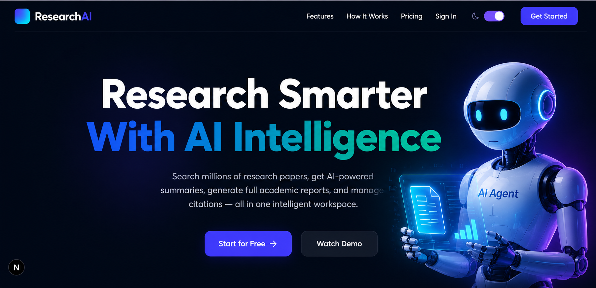

# ResearchAI — Intelligent Research Assistant

> AI-powered research tool built with **IBM Granite** on **watsonx.ai**, Next.js 15, Express, and MongoDB Atlas.

  

---

## 🚀 Quick Start (Local Dev)

### Prerequisites
- Node.js 20+
- MongoDB Atlas account (or local MongoDB)
- IBM watsonx.ai account (optional — app works in offline mode without it)

### 1. Clone & Install

```bash
# Backend
cd researchai/backend
cp .env.example .env      # fill in your credentials
npm install
npm run dev               # starts on http://localhost:5000

# Frontend (new terminal)
cd researchai/client
cp .env.example .env.local
npm install
npm run dev               # starts on http://localhost:3000
```

### 2. Visit the App

Open **http://localhost:3000** — you'll see the landing page.

Register → verify email OTP → login → access full dashboard.

---

## 🏗️ Architecture

```
researchai/
├── client/          # Next.js 15 (App Router) + TailwindCSS + Framer Motion
│   └── src/
│       ├── app/
│       │   ├── page.tsx                  # Landing page
│       │   ├── auth/login/               # Login
│       │   ├── auth/register/            # Register + OTP verify
│       │   └── dashboard/               # Protected dashboard
│       │       ├── page.tsx             # Dashboard home
│       │       ├── research/            # AI paper search
│       │       ├── reports/             # Report generator
│       │       ├── citations/           # Citation manager
│       │       ├── library/             # Reference library
│       │       └── settings/            # Profile & settings
│       ├── lib/api.ts                   # Axios + token refresh
│       └── store/authStore.ts           # Zustand auth state
│
└── backend/         # Express + TypeScript + MongoDB
    └── src/
        ├── app.ts                       # Express server
        ├── config/db.ts                 # MongoDB connection
        ├── models/                      # Mongoose schemas
        │   ├── User.ts
        │   ├── Paper.ts
        │   ├── Report.ts
        │   └── Citation.ts
        ├── controllers/                 # Route handlers
        ├── routes/                      # Express routers
        ├── services/
        │   ├── watsonxService.ts        # IBM Granite API
        │   ├── arxivService.ts          # arXiv paper search
        │   └── citationService.ts       # Citation formatting
        ├── middleware/auth.ts           # JWT middleware
        └── utils/email.ts              # Nodemailer OTP
```

---
### 🏠 AI Research Agent – Home Page
<p align="center">
  
</p>

The Home Page is the landing page of the AI Research Agent platform. It is designed with a modern, futuristic UI that immediately communicates the platform's purpose—helping researchers students and professionals perform research faster using Artificial Intelligence.

🧭 Navigation Bar

The navigation bar remains fixed at the top of the page and provides quick access to all major sections of the website.

🔹 Brand Logo

The ResearchAI logo represents innovation intelligence and modern AI technology. It establishes a strong brand identity while maintaining a clean and professional appearance.

🔹 Navigation Menu

The navigation menu contains the following sections:

Features – Explore all AI-powered functionalities available on the platform.
How It Works – Learn the complete workflow of the AI Research Agent.
Pricing – View subscription plans and premium features.
Sign In – Secure login for existing users.

🎯 Call-to-Action Buttons

Two strategically placed buttons guide users toward different actions.

Purpose
● User Registration
● Free Trial Access
● Increase Conversion Rate
● Direct users to the dashboard after signup

Its vibrant blue-purple gradient makes it the most noticeable interactive element on the page.

✨ Key Features Highlighted
AI-powered research assistance
Research paper search
AI-generated summaries
Academic report generation
Citation management


## 🔑 Environment Variables

### Backend (`backend/.env`)

| Variable | Description |
|---|---|
| `MONGO_URI` | MongoDB Atlas connection string |
| `JWT_SECRET` | Access token secret (min 32 chars) |
| `JWT_REFRESH_SECRET` | Refresh token secret |
| `IBM_WATSONX_API_KEY` | IBM Cloud API key |
| `IBM_WATSONX_PROJECT_ID` | watsonx.ai project ID |
| `IBM_GRANITE_MODEL_ID` | e.g. `ibm/granite-13b-instruct-v2` |
| `EMAIL_USER` | Gmail address |
| `EMAIL_PASS` | Gmail App Password |
| `CLIENT_URL` | Frontend URL (e.g. `http://localhost:3000`) |

### Frontend (`client/.env.local`)

| Variable | Description |
|---|---|
| `NEXT_PUBLIC_API_URL` | Backend API URL (e.g. `http://localhost:5000/api`) |

---

## 📡 API Reference

| Method | Endpoint | Auth | Description |
|---|---|---|---|
| POST | `/api/register` | No | Create account, send OTP |
| POST | `/api/verify-otp` | No | Verify email OTP |
| POST | `/api/login` | No | Login, get JWT tokens |
| POST | `/api/refresh` | Cookie | Refresh access token |
| POST | `/api/logout` | Cookie | Logout, clear tokens |
| GET | `/api/profile` | JWT | Get user profile |
| PUT | `/api/profile` | JWT | Update profile |
| POST | `/api/research` | JWT | Search arXiv papers |
| POST | `/api/summarize` | JWT | AI summarize a paper |
| POST | `/api/hypothesis` | JWT | Generate hypotheses |
| POST | `/api/save` | JWT | Save paper to library |
| GET | `/api/library` | JWT | Get saved papers |
| DELETE | `/api/library/:id` | JWT | Delete saved paper |
| GET | `/api/history` | JWT | Recent activity |
| POST | `/api/report` | JWT | Generate full report |
| GET | `/api/reports` | JWT | List reports |
| GET | `/api/reports/:id` | JWT | Get single report |
| POST | `/api/citation` | JWT | Generate citation formats |
| GET | `/api/citations` | JWT | List citations |

---

## 🐳 Docker

```bash
# Copy .env files first, then:
docker-compose up --build
```

---

## 🌐 Deployment

- **Frontend** → Vercel: `cd client && vercel --prod`
- **Backend** → Render: Set env vars in Render dashboard, connect GitHub repo
- **Database** → MongoDB Atlas (free M0 cluster)
- **AI** → IBM watsonx.ai (free trial available)

---

## 📄 License

MIT — Built with ❤️ using IBM Granite × watsonx.ai
